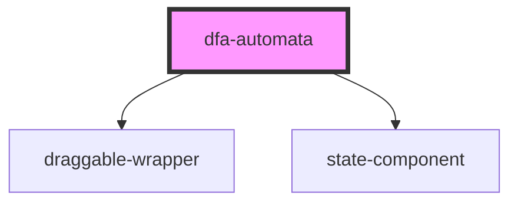

# dfa-automata

<!-- Auto Generated Below -->

## Properties

| Property | Attribute | Description | Type       | Default     |
| -------- | --------- | ----------- | ---------- | ----------- |
| `model`  | --        |             | `DFAmodel` | `undefined` |

## Dependencies

### Depends on

- [draggable-wrapper](../draggable-wrapper)
- [state-component](../state-component)

### Graph

----------------------------------------------

*Built with [StencilJS](https://stenciljs.com/)*
