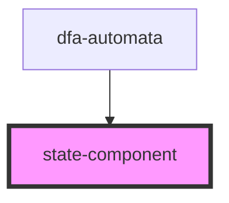

# state-component

<!-- Auto Generated Below -->

## Properties

| Property | Attribute | Description | Type         | Default     |
| -------- | --------- | ----------- | ------------ | ----------- |
| `model`  | --        |             | `StateModel` | `undefined` |

## Events

| Event         | Description | Type                                    |
| ------------- | ----------- | --------------------------------------- |
| `destroy`     |             | `CustomEvent<number>`                   |
| `nameChange`  |             | `CustomEvent<[number, string, string]>` |
| `selectState` |             | `CustomEvent<[number, boolean]>`        |
| `update`      |             | `CustomEvent<void>`                     |

## Dependencies

### Used by

 - [dfa-automata](../dfa-automata)

### Graph

----------------------------------------------

*Built with [StencilJS](https://stenciljs.com/)*
